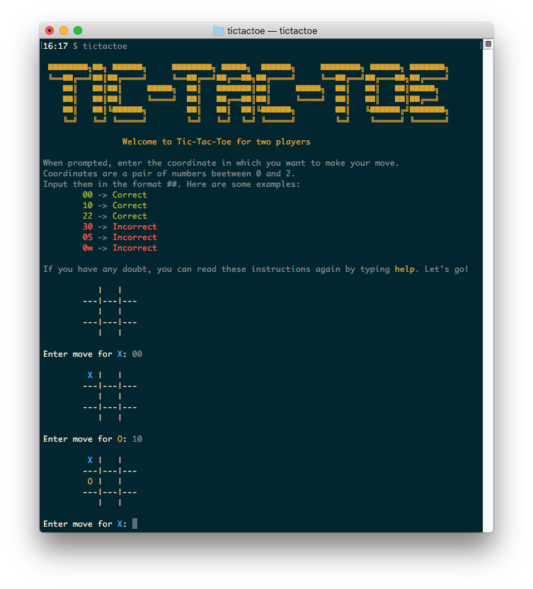

# Tic-Tac-Toe [](https://travis-ci.org/emenegro/tictactoe)

A simple Tic-Tac-Toe CLI game as an exercise to learn Ruby language.



## Installation

You can run it in several ways. 

In your terminal run `bin/tictactoe` or `ruby lib/tictactoe.rb` command.

Or generate the `tictactoe` gem and install it:

```
gem build tictactoe.gemspec
gem install tictactoe-0.0.1.gem
```

And then run `tictactoe`.

## // ToDo

- Decouple CLI presentation from game logic.
- Add one player mode.
- Analyze board and end game if no winning movements.
